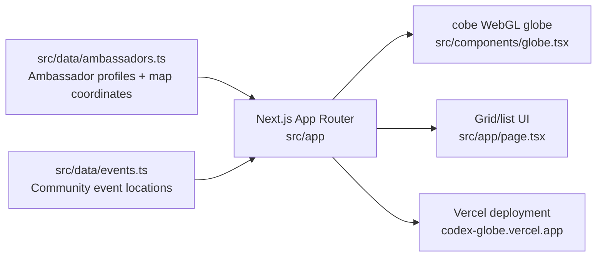

# Codex Globe

Interactive 3D globe mapping Codex Ambassadors worldwide.

**Live:** https://codex-globe.vercel.app

## Stack

- Next.js 16, React 19, TypeScript
- [cobe](https://github.com/shuding/cobe) v2 (WebGL globe)
- Tailwind CSS v4, shadcn/ui
- flag-icons for country flags

## Features

- Interactive globe with auto-rotation (pause on hover)
- Click-to-rotate to any ambassador's location
- Continent and country filters
- Globe view + Grid view (group by continent, country, or timezone)
- Mobile responsive with swipeable drawer (vaul)
- Mask fades on scrollable areas

## Architecture



## Development

```bash
bun install
bun dev
```

## Deploy

```bash
vercel --prod
```
